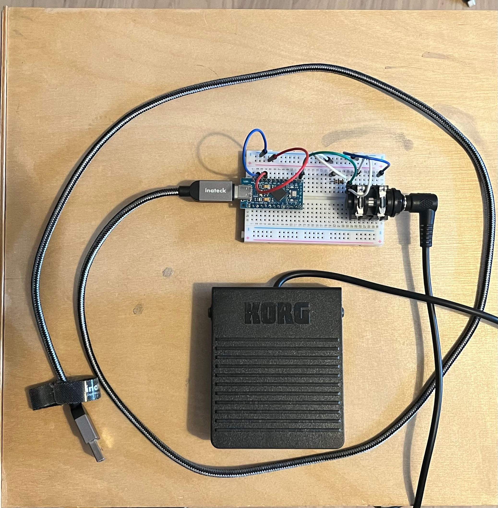
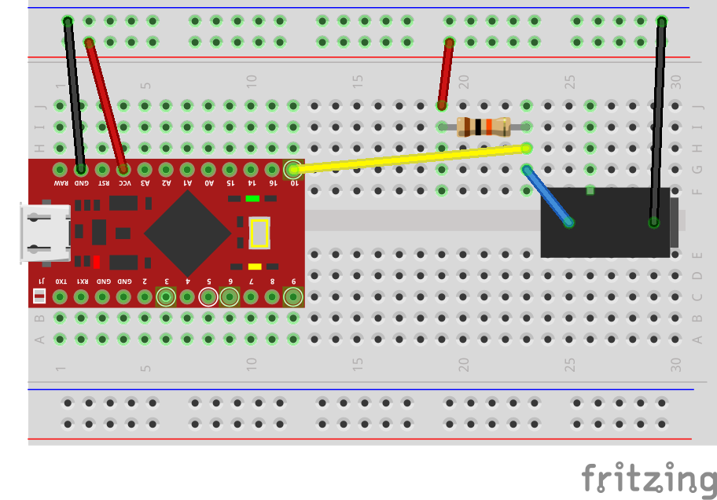

# Footswitch

As a tribute to the PS3 devkit which had a footswitch for debugging, here is a simple circuit that provides a pedal to help profiling in unity; it simulates a F9 key press to start / stop profiler recording in the profiler window :)

The setup uses a Korg pedal with a 6.35mm mono jack connector, but any equivalent pedal should work.

## Bill of materials
- An arduino "pro micro board", happens to be a copy of the sparkfun pro micro board : [sparkfun pro micro](https://www.sparkfun.com/pro-micro-5v-16mhz.html)
- A 10k resistor to make a pull-up resistor circuit
- A 6.35mm mono jack connector
- Classic breadboard and wires to create the circuit

## Schematics

A gerber file may come up at some point to switch from the breadboard to a real PCB.

## Code project
Made with platformIO, opens up with VSCode and is pre-configured for the pro micro board.
